 

  

<h2 align="center"><strong>Study Stretching With Me</strong></h2>
  

     
    

       
       
       
       
        
       
       
       
    

     
    <a href="https://www.youtube.com/watch?v=VHVgtXMp3OI">
      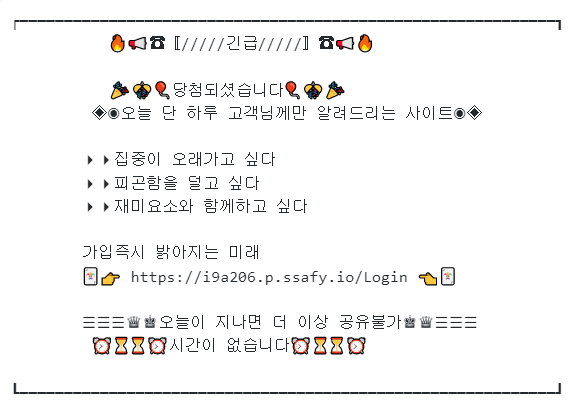
    </a>
    <h5 style="font-weight: bold;">↑ 사진을 클릭하면 UCC를 볼 수 있어요!</h5>
  

 

# 목차

1. [**서비스 소개**](#1)
2. [**기획 배경**](#2)
3. [**기능 소개**](#3)
4. [**시연 영상**](#4)
5. [**기술 스택**](#5)
6. [**프로젝트 일정 및 산출물**](#6)
7. [**개발 멤버**](#7)

 

---

 

# 1. 서비스 소개

## 서비스 설명

### 개요

- 한줄 소개 : **공부**하며 신체 **건강**을 챙기지 못하는 사람들을 위해 만든 웹서비스
- 서비스 명 : **`SSWM(스윔)`**

### 타겟 🎯

- 공부하다가 자세가 많이 망가지는 사람들
- 성장과 건강 두 가지 모두를 챙기고 싶은 사람들
- 거북목, 목디스크를 달고 사는 저희 개발자들

# 2. 기획 배경

## 배경

현재 시중에는 자신의 공부 시간을 측정하고 이를 공유하는 어플이 존재하고 있습니다.
 
스터디 그룹에 가입하고 다른 사람들과 함께 공부하고 정보 공유를 하며 공부의 효율성을 높일 수 있습니다
 
 

하지만 장시간 같은 자세로 앉아있는 행위는 거북목이나, 허리통증 등 건강이상을 유발할 수 있다고 생각했습니다.
 
따라서 공부와 휴식의 밸런스를 통해 공부의 효율성을 더욱 극대화 시킬 페이지를 만들고자 하였습니다.

## 목적 🥅

**공부를 하며 놓치는 건강을 챙기자**

## 의의

- 온라인 화상 스터디 플랫폼 기능
- 자동 휴식, 스트레칭을 통한 효율성 극대
- 나만의 나무를 기르며 성취도와 만족감 상승

# 3. 기능 소개

### 회원가입 & 로그인

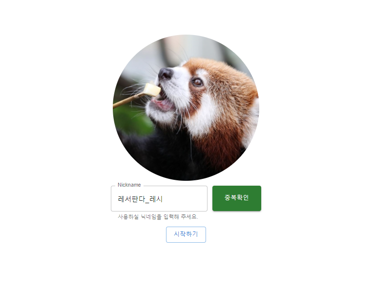
### 마이 페이지
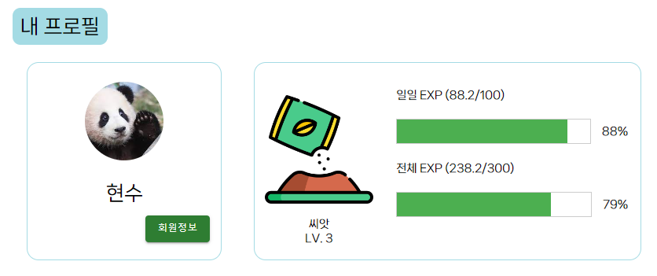
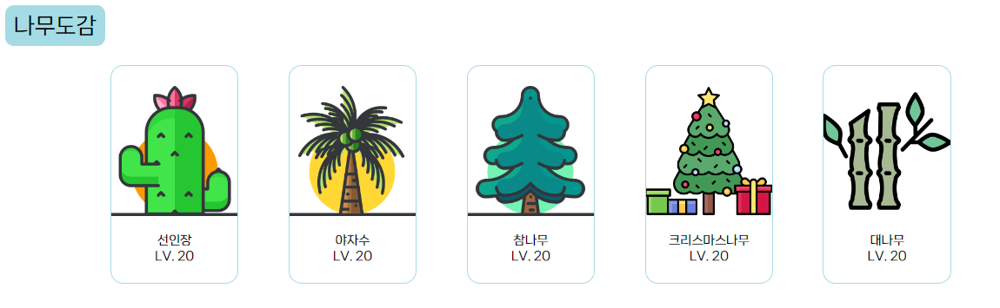

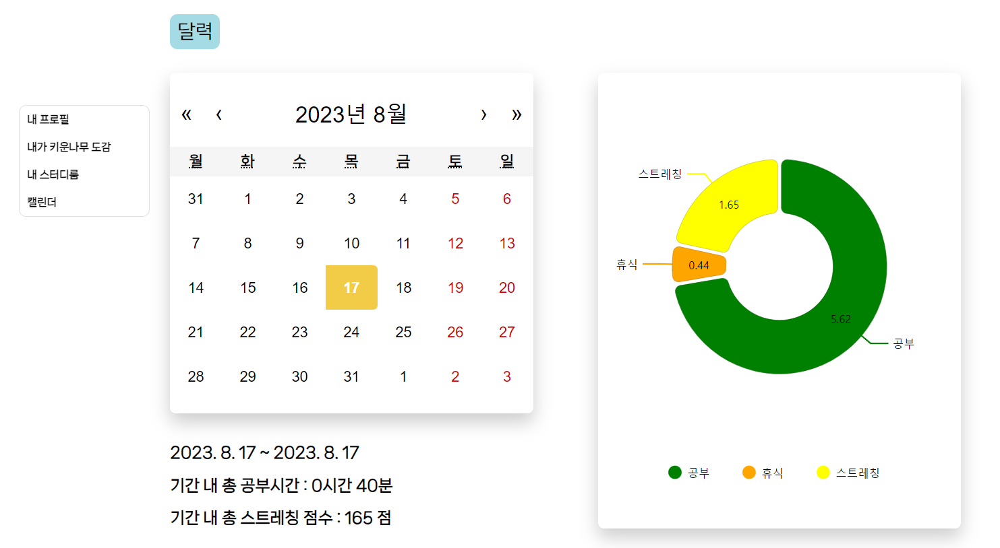
### 프로필 편집
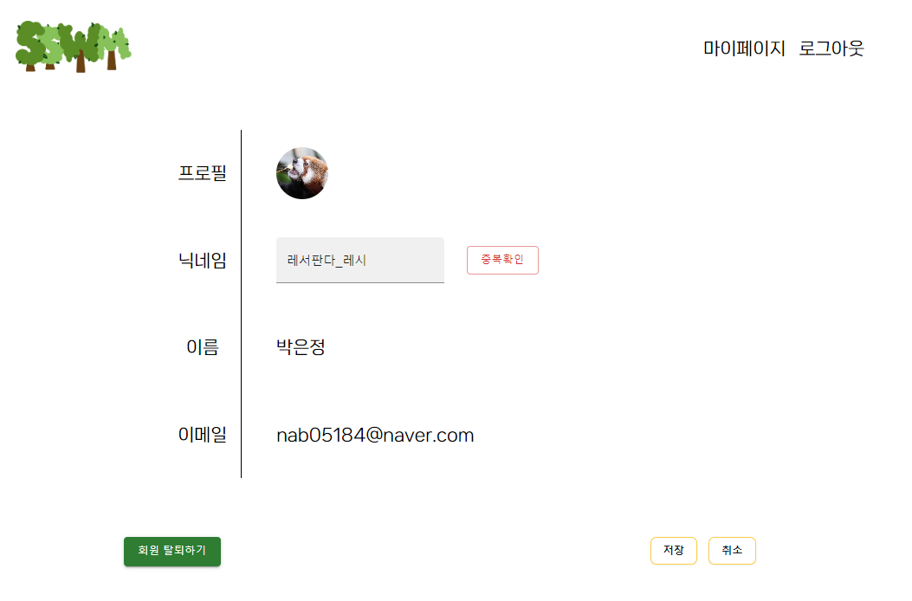
### 메인 페이지
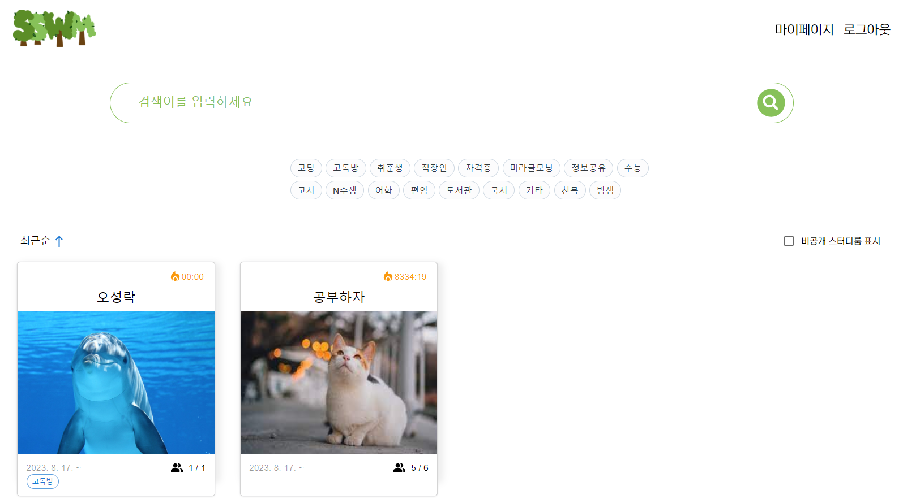
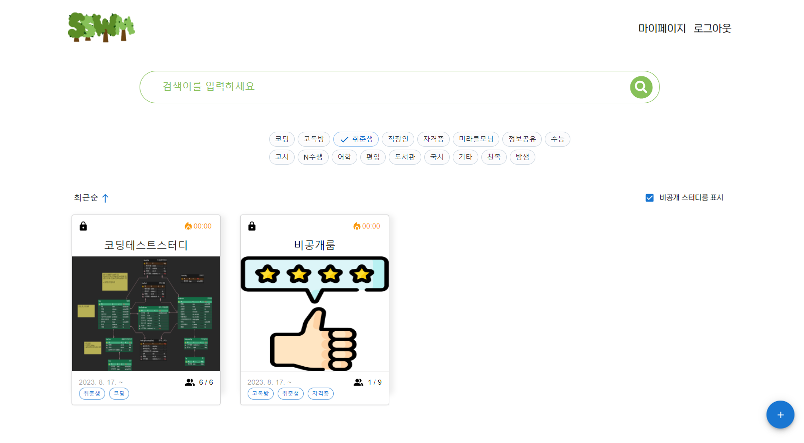
### 스터디룸 생성
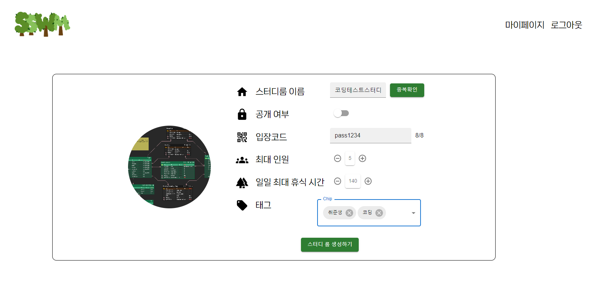
### 스터디룸 편집
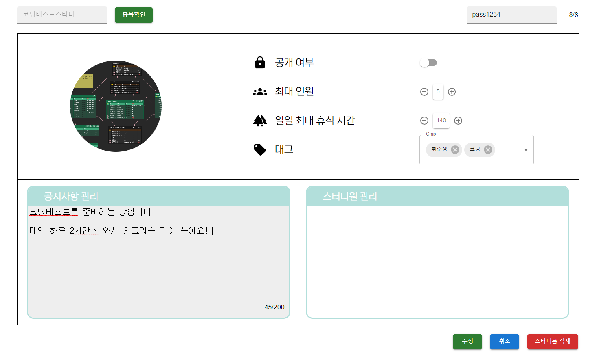
### 라이브룸
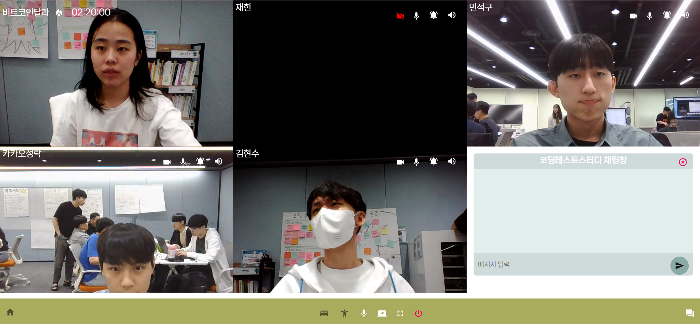
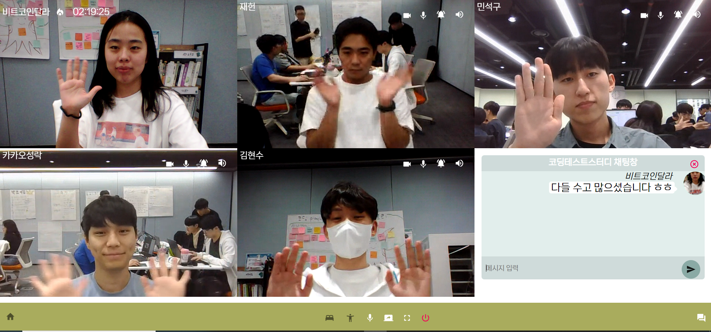
### 스트레칭
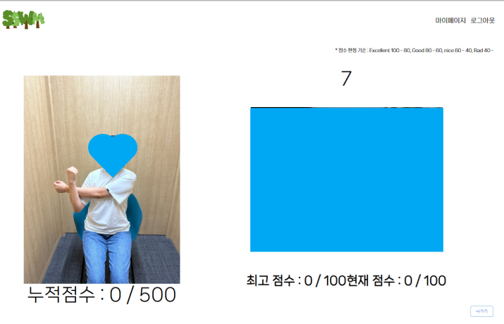

# 4. 시연 영상

[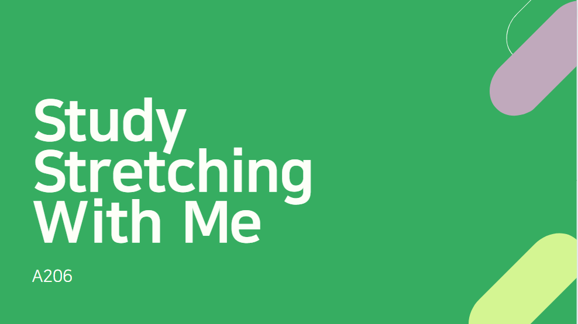](https://youtu.be/uivS5nPWuRQ)

# 5. 기술 스택

## 1. OpenVidu

### OpenVidu란?

<aside>
OpenVidu는 웹 또는 모바일 어플리케이션에서 화상 통화를 쉽게 추가할 수 있는 플랫폼입니다.

</aside>
Kurento기반의 중개 서버를 애플리케이션에 쉽게 추가할 수 있도록 완전한 기술스택을 제공합니다.

### 적용

`SSWM` 에서는 미팅시 화상 통화를 하기 위해 openVidu를 사용합니다.

## 2. Teachable Machine

### Teachable Machine 이란?

<aside>
Teachable Machine은 구글에서 만든 웹기반 노코드 인공지능 학습 툴입니다.

</aside>
이미지, 사운드, 자세를 인식하도록 컴퓨터를 학습시켜서 사이트, 앱 등에 사용할 수 있는 머신러닝 모델을 쉽고 빠르게 만들 수 있습니다. 

### 적용

`SSWM` 에서는 스트레칭 자세를 인식하기 위하여 Teachable Machine을 사용합니다.

# 6. 프로젝트 일정 및 산출물

## 프로젝트 일정
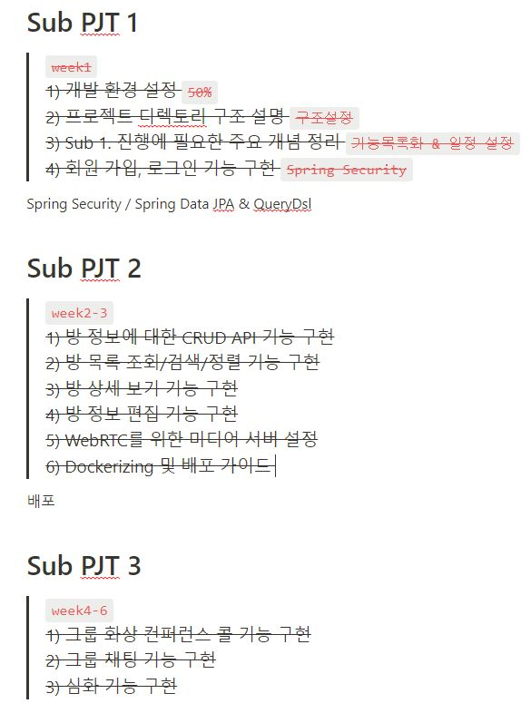

## 프로젝트 진행
### 1. Git flow
---
front 와 back 으로 나누어 `faature`의 하위 브랜치를 사용하였으며 매일 오전 스크럼 이후 `back` 브랜치와 `front` 브랜치로 merge 하여 사용했습니다. 
`commit message`는 `feat: 채팅방 구현` 과 같이 통일하여 작성했습니다. 

### 2. Jira
---
매주 월요일 오전 회의에서 금주의 진행 이슈를 백로그에 등록했습니다. 전주에 완료하지 못한 이슈나, 앞으로 진행할 이슈들을 추가합니다.
- 레이블은 BE, FE로 구성했습니다.
- 작업현황을 실시간으로 지라에 반영하여 현재 팀원이 어떤 작업을 하고있는지, 일정에 딜레이가 있는지 한 눈에 알아볼 수 있게 했습니다. 

## 프로젝트 산출물
### 1. Figma
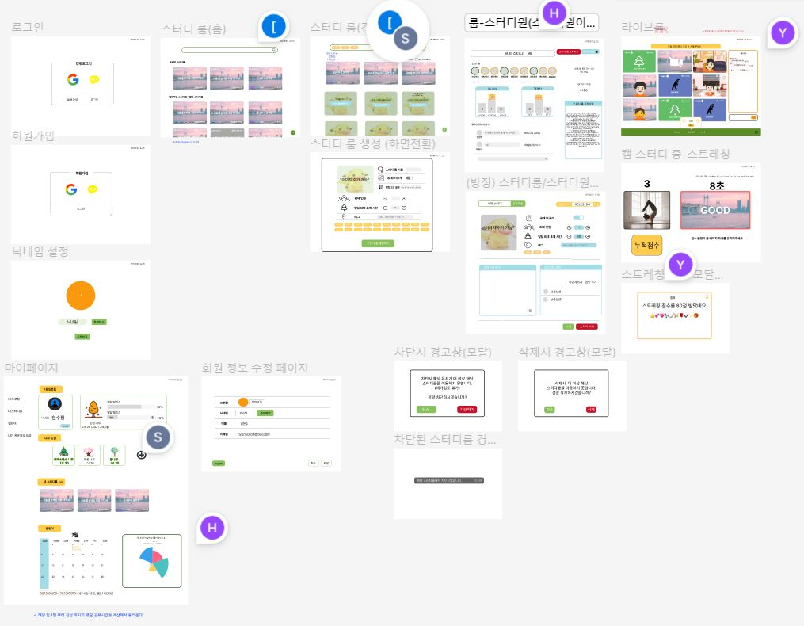
 

### 2. ERD
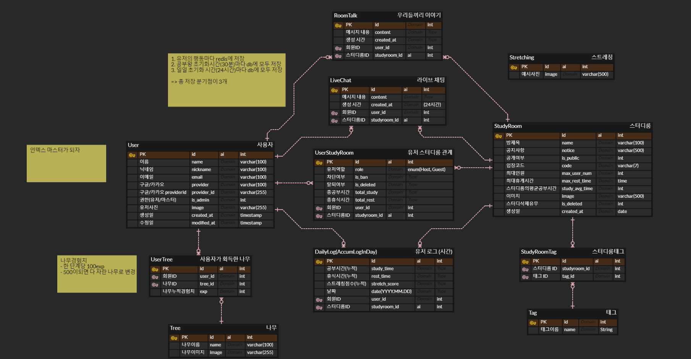
 

### 3. API 문서
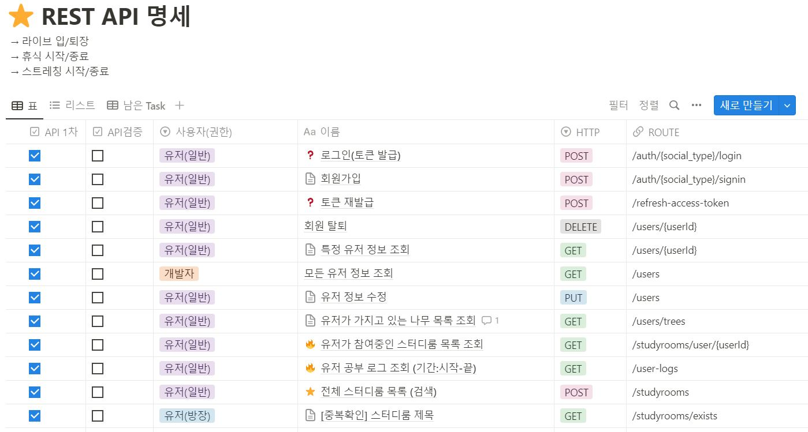

# 7. 개발 멤버

| 이름 | 주 담당 | 부 담당 |
| --- | --- | --- |
| 박은정 | 팀장, BE, CI/CD | 데이터,  FE |
| 김재헌 | CI/CD,  BE | FE(WebRTC) |
| 오성락 | FE(WebRTC) | BE |
| 구민석 | FE, 디자인 |  |
| 서수정 | FE, 디자인 | BE , 데이터 |
| 김현수 | BE | FE |

